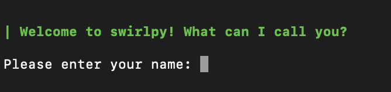

<h1 align="center"> Swirlypy Documentation </h1>

This document outlines running Swirlypy, creating a course and testing the course in development.

---

## _Swirlypy for Learners_

### Installation

To install Swirlypy, open the command line/terminal (after installing Python3), run the following command:


`pip install swirlypy`

You can also run/install through the console through Spyder if you have installed Anaconda.


### Running Swirlypy

To start Swirlypy, follow the following steps: 
 
Start Python console on Cmd Line (or Python console on Spyder) by typing python3 and then enter the following commands:

`from swirlypy import run_swirlypy`
    
`run_swirlypy.swirl()`

If successful, you should see the prompt below:

<p align="center">

</p>


Follow the instructions through the application and select a course to learn from by following the prompts. 

### Reporting Issues

If you come across issues/bugs while using Swirlypy, submit an issue to this repository: https://github.com/Samarth2506/swirlypy. If you would like to get involved or have suggestions to improve Swirlypy, refer to the section below.

---

<br />

   
## _Contributing to Swirlypy_

If you want to create a course/edit an existing course/contribute to the source code of Swirlypy: fork, clone and submit a pull request to: https://github.com/Samarth2506/swirlypy.


Packaging a course is currently under development and the following steps must be followed to create/edit a course **for now**:

### To run/edit an existing course:

* `cd to swirlypy_cloned_folder`

* Set Pythonpath with: `export PYTHONPATH: /path_to_swirlypy_folder`

Run the following commands to run swirypy:

* Start Python console on Cmd Line by typing python3 and run the following commands 

```
from swirlypy import run_swirlypy
run_swirlypy.swirl()
```

You can make changes to an existing course by navigating to the _courses_ folder in the root folder. The lesson yaml file (structure described below) can be edited. Save and re-run the application to reflect changes in the lesson.

### Creating/Testing a course


* The directory structure is as follows: _swirlypy/swirlypy/all_scripts_needed_

* The course directory is at: _swirlypy/courses/some_course/course.yaml_

In the _courses_ folder, create a new_course folder. The following structure should be followed for any new course created:

```                   
new_course
	|- course.yaml
	|- lessons
		|- first_lesson_content.yaml
		|- second_lesson_content.yaml
	|- initialize_lessons.py
    |- scripts
    
```

* You can choose from the text, command or multiple choice type questions. The course will then show up when you run Swirlypy.

* _Initialize_lesson.py_ should contain any variables/data you want to use in your lesson. For example, the Data Analysis course needs iris_data. The dataset is added in the script as a key to the data dictionary which then becomes available to the learner/creator to use in any lesson.


### Types of Questions

Lesson creators can choose from a variety of questions to create content on Swirlypy:

### Text Question

A Text question displays a string to the user. Swirlypy will move on to the next question after the user presses enter. The following fields are needed for the text question:

    Category: text
    Output: string to be displayed to user

### Command Question

A command question prompts the user for a response. For the response to be graded as correct, general syntax differences like spaces and single versus double quotes do not matter.


    Category: command
    Output: prompt/question to be displayed for the user
    Answer: correct answer to the prompt/question
    Hint: hint to be displayed if the user get's the question wrong


### Multiple Choice Question

A multiple choice question, like the name indicates, prompts the user with a question with choices. The user needs to make a choice as the answer to the question. Following are the required fields for a multiple choice question:


    Category: command
    Output: prompt/question to be displayed for the user
    Choices:
        - choice_1
        - choice_2
    
    Answer: correct choice that is the answer to the question
    Hint: hint to be displayed if the user get's the choice wrong
    
### Script Question

A script question opens up an editor for students to answer complicated questions that cannot be scripted in a few lines. Swirlypy matches the output of the user's script to the output of a pre-defined correct script by the lesson creator. Following are the fields required for a script question:

    Category: script
    Output:  prompt/question to be displayed for the user
    user_script: name of the user script; must be present in the scripts folder of the course
    correct_script: name of the correct script; must be present in the scripts folder of the course
    test_cases: name of list with cases to the script must be tested with; list should be in custom_tests.py
    hint: hint to be displayed if the user get's the script wrong
    
    
Thanks for reading and happy learning/creating!

